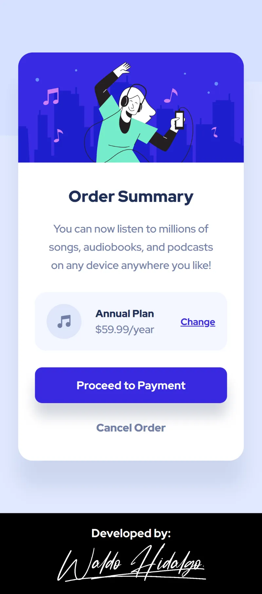
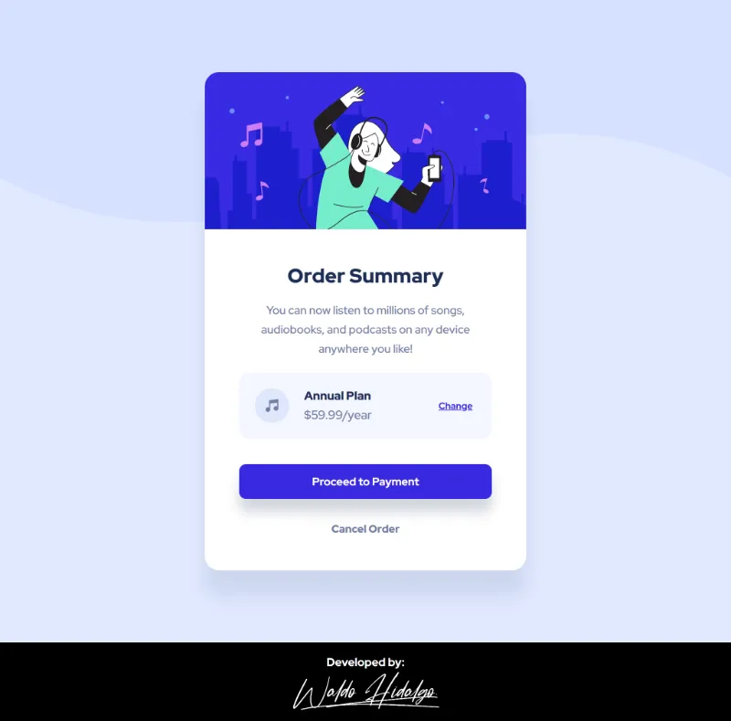
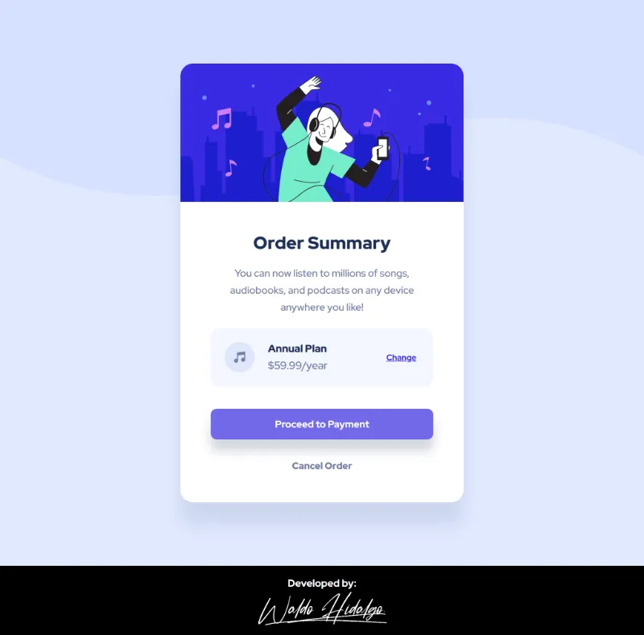

# Order summary card

Repositorio con el código solución al challenge: [Order summary card challenge on Frontend Mentor](https://www.frontendmentor.io/challenges/order-summary-component-QlPmajDUj).

## Tabla de Contenidos

- [Order summary card](#order-summary-card)
  - [Tabla de Contenidos](#tabla-de-contenidos)
  - [The challenge](#the-challenge)
  - [Diseños a Replicar](#diseños-a-replicar)
    - [1. Mobile Design](#1-mobile-design)
    - [2. Desktop Design](#2-desktop-design)
    - [3. Active States](#3-active-states)
  - [Proyecto Realizado](#proyecto-realizado)
    - [1. Mobile Size](#1-mobile-size)
    - [2. Desktop Size](#2-desktop-size)
    - [3. Active States](#3-active-states-1)

## The challenge

El desafío consiste en realizar lo siguiente:

> Your challenge is to build out this order summary card component and get it looking as close to the design as possible.
>
> You can use any tools you like to help you complete the challenge. So if you've got something you'd like to practice, feel free to give it a go.
>
> Your users should be able to:
>
> - See hover states for interactive elements

## Diseños a Replicar

### 1. Mobile Design

### 2. Desktop Design

### 3. Active States

## Proyecto Realizado

### 1. Mobile Size

### 2. Desktop Size

### 3. Active States

